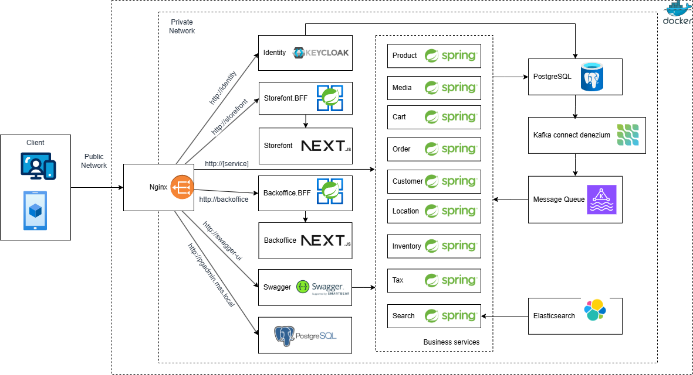

# MSS: E-commerce Shop, a sample microservices project in Java

MSS is a pet project aim to practice building a typical microservice application in Java

## Tentative technologies and frameworks

- Java 21
- Spring boot 3.3
- Next.js
- Keycloak
- Kafka
- Elasticsearch

## Local development architecture



## Getting started with Docker Compose

1. Get the latest source code
2. Add the following records to your host file:
```
127.0.0.1 identity
127.0.0.1 api.mss.local
127.0.0.1 pgadmin.mss.local
127.0.0.1 storefront
127.0.0.1 backoffice
127.0.0.1 elasticsearch
127.0.0.1 kafka
```
3. Open terminal of your choice, go to `mss` directory, run `docker compose up`, wait for all the containers up and running. Open your browser, now you can access the websites via `http://storefront/`; `http://backoffice/` login with admin/password

#### You might also want to explore:
1. `http://api.mss.local/swagger-ui/` for all the REST API document of all the services
2. `http://identity/` for Keycloak console, account admin/admin
3. `http://elasticsearch/` for calling Elasticsearch APIs

#### About docker-compose files
1. docker-compose.yml for all core services

## Screenshots


